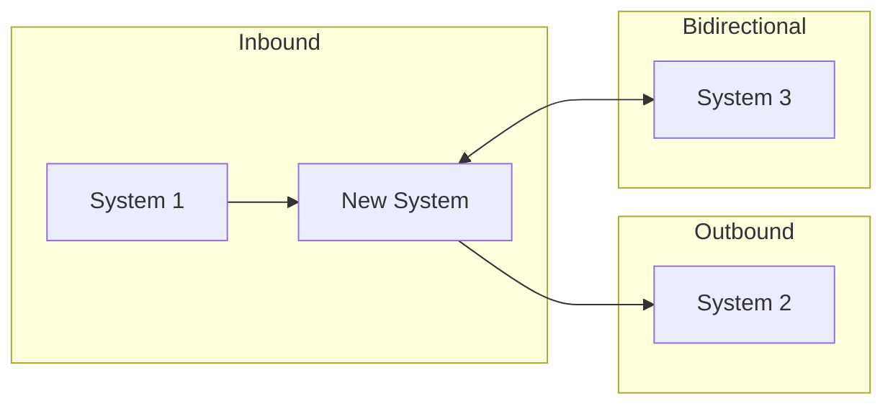

# Step 2: Document

**Progress:** Step 2 of 2 → Final Step

**Goal:** Generate the complete integration specification document.

---

## Instructions

### 1. Create Document

Copy `{template}` to `{outputFile}` and populate all sections.

---

### 2. Generate Mermaid Diagram

Create system landscape diagram:



---

### 3. Complete Integration Points

For each system, fill in the full profile table with all details gathered.

---

### 4. Data Mapping Tables

Create mapping tables for each data flow. Include:
- Field-level mappings
- Any transformations needed
- Data type conversions
- Validation rules

---

### 5. Error Handling Matrix

Define error handling for common scenarios:
- Connection failures
- Timeout
- Invalid/rejected data
- System unavailable
- Rate limiting

---

### 6. Implementation Sequence

Order integrations by:
1. Dependencies (what must be done first)
2. Criticality (most important first)
3. Complexity (quick wins vs. complex)

---

### 7. Present Document

Display the complete integration spec to user.

"**Integration Specification Generated**

**Summary:**
- Total integrations: {count}
- Critical: {count}
- Implementation phases: {count}

**Systems:**
{list with direction}

Review the document. Any adjustments needed?"

---

### 8. Finalize

**Menu:**
```
[V] View → Display full document
[R] Revise → Make changes
[X] Exit → Complete
```

**On [X]:**

Update frontmatter:
```yaml
stepsCompleted: ['step-01-discovery', 'step-02-document']
completedAt: '{timestamp}'
```

**Completion Message:**
"Integration spec saved to `{outputFile}`.

**Next steps:**
- Review with system owners
- Confirm access/credentials for each system
- Include in PRD Technology Constraints section
- Run `/prd-create` if not done, or `/create-architecture` to proceed"
