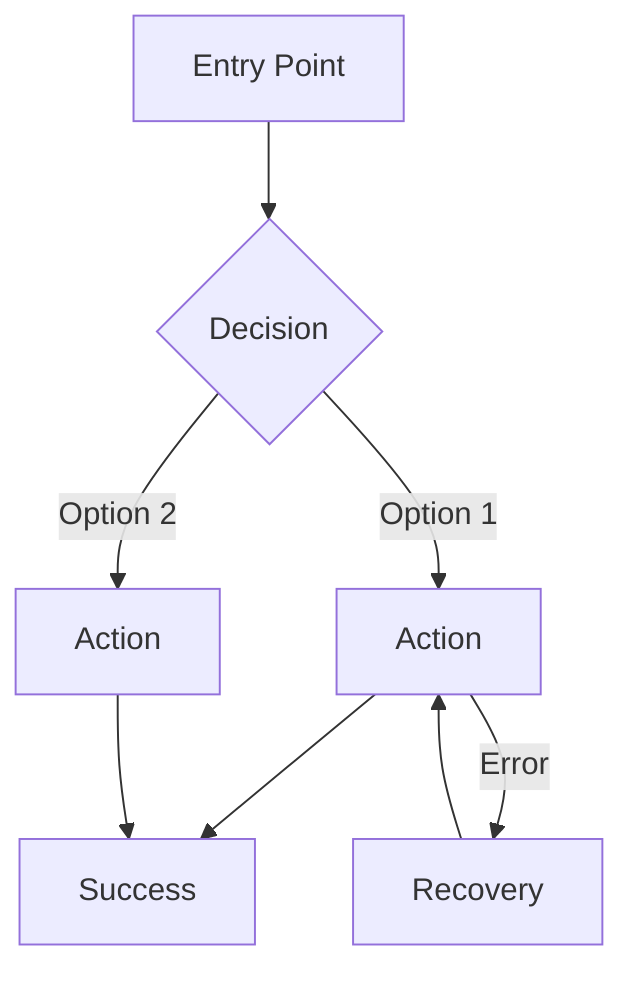

# Step 2: Discovery

**Progress: Step 2 of 4** - Next: Design System

## STEP GOAL

Understand users, define information architecture, map user journeys, and establish core experience principles.

## EXECUTION RULES

- **Interactive step** - requires user collaboration
- You are a UX Facilitator - extract insights, don't lecture
- Use loaded documents to inform questions (don't ask what's documented)

## SEQUENCE (Follow Exactly)

### 1. Synthesize Loaded Context

Review all loaded documents and summarize:

"Based on the documents loaded for {{project_name}}:

**Project Summary:** [Key insights from PRD and brief]
**Target Users:** [User personas and characteristics]
**Key Features:** [Main capabilities from requirements]

Does this match your understanding?"

### 2. Fill Context Gaps

If documents incomplete, ask:
- What are you building? (1-2 sentences)
- Who is this for? (target audience)
- What makes this special? (unique value)
- What's the main user action? (core goal)

### 3. Information Architecture

#### A. Explore User Context

- What problem are users solving?
- What frustrates them with current solutions?
- How tech-savvy are they?
- Primary device usage?

#### B. Define Content Structure

"**Content Inventory:**
- What content/features need to be organized?
- What are the main content types?

**Navigation Structure:**
- Primary navigation items?
- Secondary/utility navigation?
- How deep should hierarchy go?

**Mental Model:**
- How do users expect information organized?
- What terminology do they use?"

#### C. Create Site Map

"**Proposed Structure:**
```
├── [Primary Section 1]
│   ├── [Subsection]
│   └── [Subsection]
├── [Primary Section 2]
│   └── [Subsection]
└── [Utility Area]
    ├── [Settings]
    └── [Account]
```

Does this match how users think about the product?"

### 4. User Journeys

#### A. Identify Critical Journeys

If PRD loaded, extract existing journeys. Otherwise ask:
"What are the 3-5 most critical user journeys?
- First-time user onboarding?
- Core task completion?
- Error recovery?
- Return user flow?"

#### B. Design Each Journey

For each journey, explore:
- Entry point: How do users start?
- Information needed: What do they need at each step?
- Decisions: What choices do they make?
- Progress feedback: How do they know it's working?
- Success state: What does completion look like?
- Error recovery: How do they recover from mistakes?

#### C. Create Mermaid Diagrams



### 5. Core Experience

#### A. Define Core Interaction

"**Core Experience Questions:**
- What's the ONE thing users will do most frequently?
- What user action is critical to get right?
- What should be completely effortless?

**Famous examples:**
- Tinder: 'Swipe to match'
- Spotify: 'Discover and play any song instantly'
- Instagram: 'Share perfect moments with filters'"

#### B. Define Emotional Goals

"**How should users feel?**
- During first use?
- While performing core action?
- After completing their goal?
- When something goes wrong?

**Common goals:** Empowered, delighted, efficient, creative, calm, connected"

#### C. Identify Effortless Interactions

- What actions should require zero thought?
- Where do users struggle with competitors?
- What could be automated?
- Where can we eliminate steps?

#### D. Platform Requirements

- Web, mobile, desktop, or multi-platform?
- Touch-based or keyboard/mouse?
- Offline functionality needed?
- Device capabilities to leverage?

#### E. Synthesize Experience Principles

Extract 3-5 guiding principles:
"**Experience Principles for {{project_name}}:**
1. [Principle from core action focus]
2. [Principle from effortless interactions]
3. [Principle from emotional goals]"

### 6. Identify Design Challenges

"**Design Challenges:**
- [Challenge from project type]
- [Challenge from user needs]
- [Challenge from IA complexity]

**Design Opportunities:**
- [Opportunity for competitive advantage]
- [Opportunity for innovation]"

### 7. Update Document

Append all discovery content to `{outputFile}`:

```markdown
## Discovery & Information Architecture

### Project Vision
{project_vision}

### Target Users
{target_users}

### Information Architecture

#### Content Structure
{content_inventory}

#### Navigation Hierarchy
{navigation_structure}

#### Site Map
{sitemap_diagram}

### Key Design Challenges
{design_challenges}

### Design Opportunities
{design_opportunities}

---

## User Journeys

### Critical Journeys Identified
{journey_list}

### [Journey 1 Name]
{journey_description}

```mermaid
{journey_diagram}
```

**Key Interactions:**
{interaction_details}

### [Journey 2 Name]
{journey_description}

```mermaid
{journey_diagram}
```

### Journey Patterns
{common_patterns}

### Flow Optimization Notes
{optimization_principles}

---

## Core Experience

### Defining Interaction
{core_experience_statement}

### Emotional Design Goals

#### Primary Emotional Goal
{primary_emotion}

#### Emotional Journey Map
| Stage | Emotion | Design Approach |
|-------|---------|-----------------|
{emotional_journey_table}

### Effortless Interactions
{effortless_areas}

### Platform Strategy
{platform_requirements}

### Experience Principles
{guiding_principles}
```

### 8. Report & Menu

**Report:**
"Discovery complete for {{project_name}}.

**Captured:**
- ✅ Information Architecture & Site Map
- ✅ User Journeys with Diagrams
- ✅ Core Experience Principles

**Key Insight:** [Most important discovery finding]

Ready to define the design system?"

**Menu:**

**[C] Continue** - Proceed to Design System (Step 3)
**[R] Revise** - Discuss changes to discovery content
**[D] Deep Dive** - Refine IA, journeys, or experience principles
**[P] Party Mode** - Multiple perspectives on UX direction

**On [C]:** Update frontmatter (`stepsCompleted` add `'step-02-discovery'`), then load and execute `{nextStepFile}`.

**On [R]:** Discuss changes, update document, return to menu.

**On [D]:** Invoke `/_deep-dive` on specific area. Update document, return to menu.

**On [P]:** Invoke `/_party-mode` for multi-perspective analysis. Update document, return to menu.

---

## SUCCESS CRITERIA

- Project context synthesized from loaded documents
- Information architecture defined with site map
- Critical journeys mapped with Mermaid diagrams
- Core experience and emotional goals established
- Experience principles documented
- User confirmed before proceeding
